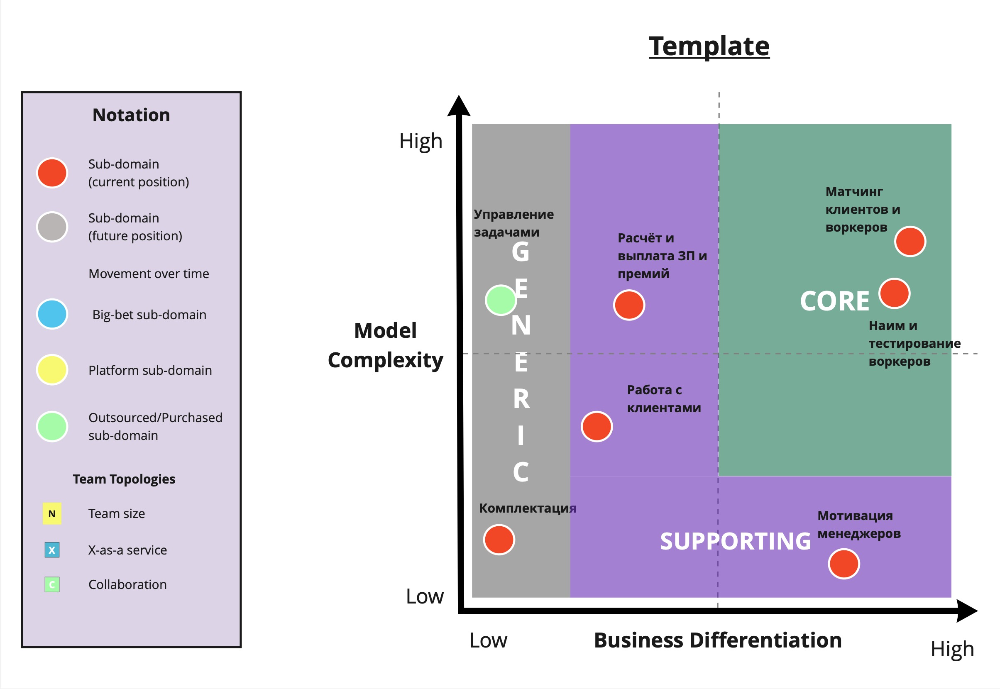
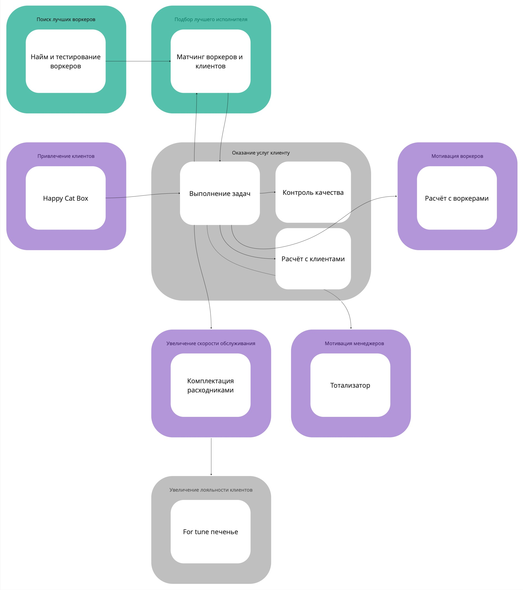

Домашняя работа N2
==================

Поддомены
---------

|Вид поддомена                  |Конкурентное преимущество |Сложность доменной модели  |Изменчивость|Интерес проблемы|Предполагаемый вид поддомена|
|-------------------------------|--------------------------|---------------------------|------------|----------------|--------------------------  |
|Привлечение клиентов           | нет                      | низкая                    | средняя    | низкий         | supporting                 |
|Увеличение лояльности клиентов | нет                      | низкая                    | средняя    | низкий         | generic                    |
|Поиск лучших воркеров          | да                       | высокая                   | частая     | высокий        | core                       |
|Матчинг клиентов и воркеров    | да                       | высокая                   | частая     | высокий        | core                       |
|Выполнение заказов             | нет                      | средняя                   | редкая     | высокий        | generic                    |
|Улучшение скорости обслуживания| нет                      | низкая                    | редкая     | низкий         | supporting                 |
|Мотивация менеджеров           | нет                      | низкая                    | редкая     | низкий         | supporting                 |
|Мотивация воркеров             | нет                      | низкая                    | частая     | средний        | supporting                 |

Core domain chart
-----------------

[Ссылка на jpg](core-domain-chart.jpg)

Схема bounded-конекстов
-----------------

[Ссылка на jpg](bounded-context.jpg)

Характеристики, важные для системы
----------------------------------
* Securability (security) - требование US-081, там про возможность ддос.
* Elasticity - нагрузка на систему приёма заявок может увеличится.
* Modifiability - алгоритм матчинга еще не разработан, он является core поддоменом и ожидается, что будет часто менятся реализация.
* Agility - нужен высокий Time to market, есть в требованиях
* Simplicity - требование US-140

Различие bounded-контекстов с ES-моделью из первого домашнего задания:
----
Матчинг и тестирование кандидатов после анализа поддоменов выделились в отдельные bounded-контексты, в ES модели их не было.

