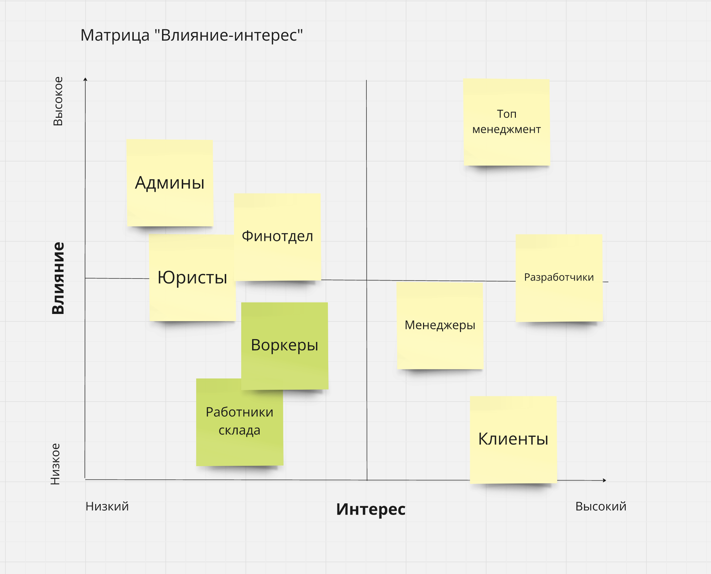

Домашняя работа N3
==================

Группы стекхолдеров
-------------------

[Ссылка на png](stackholders.png)

Зелёным выделены стекхолдеры найденные самостоятельно. Предположу, что воркеры хотели бы сами выставлять желаемую нагрузку в день и иметь возможность взять выходные. Это все повлияет на bounded-контекст матчинга воркеров. Консерны работников склада описаны в user-story - они хотят простой интерфейс.

Характеристики
--------------

[Ссылка на jpg](characteristics.jpg)

Есть сомнения, что воркеры справятся с описанной менеджерами нагрузкой в 10 заказов в минуту. Имитационным моделированием я посчитал, что для этого придётся иметь штат минимум в 700 воркеров. Учитывая высокие критерии отбора в воркеры, нанять такое количество будет проблематично. Если нагрузка увеличится, то потребуется еще больше исполнителей.

Скорее всего придётся отказаться от части заказов.

Структура
---------

[Ссылка на jpg](structure.jpg)

* Найм и тестирование воркеров - выделен в отдельный сервис, так как топ-менеджеры хотят продавать доступ к нему другим компаниям. Также, релизный цикл отличается сервиса отличается от остальной системы. Это модульный монолит из-за сложной модели предметной области.
* Матчинг клиентов и воркеров - выделен в отдельный сервис, так как нужен высокий показатель modularity и modifiability. Также разработчики алгоритма матчинга говорят о том, что им нужен сервис в стиле pipeline, что отличается от остальной системы.
* Расчёт с воркерами - в отдельном сервисе из-за требований финотдела о высокой консистентности и сохранности данных. Модульный монолит из-за сложной предметной области.
* Выполнение задач и контроль качества поместил в один сервис, так как эти два bounded-контекста связаны между собой и не содержат каких-то особых или взаимоисключающих требований. Модульный монолит.
* Расчёт с клиентами - в отдельном сервисе из-за требований финотдела о высокой консистентности и сохранности данных. Также есть требование высокой modularity и evolvability для добавления новых методов оплаты. Microkernel для обеспечения этих характеристик.
* Тотализатор - в отдельном сервисе чтобы скрыть его от остальных отделов и разработчиков. Кроме того он не будет часто меняться. Layered-монолит, можно отдать менее квалифицированным разработчикам.
* Комплектация расходниками - ни с одним другим его не объединить, поэтому выделен в отдельный сервис. Layered-монолит, можно отдать менее квалифицированным разработчикам.

Выбор БД
--------

Для каждого сервиса выбрал бы реляционные БД. Есть сомнения по поводу матчинга для клиентов и воркеров. Возможно им больше подойдет документоориентированная БД для большей гибкости, либо колоночная для более быстрых расчётов. Недостаточно информации, чтобы решить. Оставил реляционную, так как подойдёт в большинстве случаев.

Коммуникация между сервисами
----------------------------

[Ссылка на jpg](communication.jpg)

Нам не нужно, чтобы данные во всей системе были консистентные. Так же нужно уведомлять сервисы расчёта с воркерами, расчёта с клиентами, тотализатор и комплектацию расходников о жизненном цикле заказа, и сервисы матчинга воркера, выполнения заказов и расчёта с воркерами о том, что в системе появился новый воркер. Проще всего это реализовать посредством асинхронной отправки событий.

Фитнес функции
--------------

Предположу, что система будет реализована на языке программирования python, так как больше всего с ним знаком.
* [coverage](https://coverage.readthedocs.io) - измерение покрытия кода тестами
* [importlinter](https://github.com/seddonym/import-linter) - для соблюдения границ между модулями в модульных монолитах.
* метрики из системы уравления задачами для измерения TTM.
* sentry для мониторинга ошибок.
* нагрузочные тестирования для проверки характеристик elasticity и scalability.
* время, занимаемое выкаткой новой версии в прод.
* время, занимаемое тестированием тестировщика новых фич.

ADR
---

[Изолирование сервиса расчёта с клиентами](./adr/01-we-will-separate-billing-service.md)
