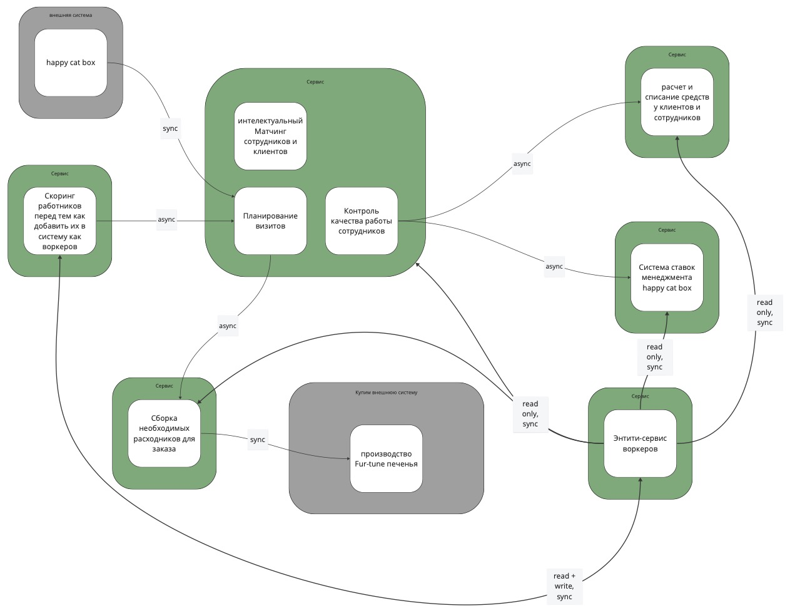

Домашняя работа N4
==================

Система для распила
-------------------

[Ссылка на jpg](init-system.jpg)

Instability до объединения
-----------

| Сервис | Афферентная связанность | Эфферентная связанность | Instability |
|--------|-------------------------|-------------------------|-------------|
| Энтити-сервис воркеров    | 1    | 5                       | 0.83        |
| Сервис скоринга           | 1    | 1                       | 0.5         |
| Система ставок менеджмента| 2    | 0                       | 0           |
| Расчёт и списание средств | 2    | 0                       | 0           |
| Сборка расходников        | 2    | 1                       | 0.33        |
| Сервис заказов            | 3    | 3                       | 0.5         |

Я собираюсь объединить энтити-сервис воркеров с сервисом скоринга работников: 
* только сервис скоринга записывает новые данные о работниках.
* можно избавиться от лишних связей между этими двуюмя сервисами - глобальная сложность уменьшится.

Объединённый сервис будет асинхронно стримить данные о сотрудниках в другие сервисы,
которые раньше ходили по синхронному API в entity-сервис.

Instability после объединения
-----------
| Сервис | Афферентная связанность | Эфферентная связанность | Instability |
|--------|-------------------------|-------------------------|-------------|
| Сервис скоринга           | 0    | 5                       | 1           |
| Система ставок менеджмента| 2    | 0                       | 0           |
| Расчёт и списание средств | 2    | 0                       | 0           |
| Сборка расходников        | 2    | 1                       | 0.33        |
| Сервис заказов            | 3    | 3                       | 0.5         |

План работ
----------

План работ совпадает для обоих вариантов:
- когда свободных людей и ресурсов нет, а опыт и (или) инфраструктура есть
- когда есть свободные люди и ресурсы, а опыта и (или) инфраструктуры нет

1. Реализовать в сервисe скоринга работников отправку стриминг-событий о воркерах в дополнение к синхронной записи в entity сервис.
Это позволит планомерно поменять вид коммуникации в сервисах-потребителях с синхронного на асинхронный.

2. Когда асинхронный способ коммуникации с сервисом скоринга будет реализован во всех сервисах, удалить entity-сервис из системы.
